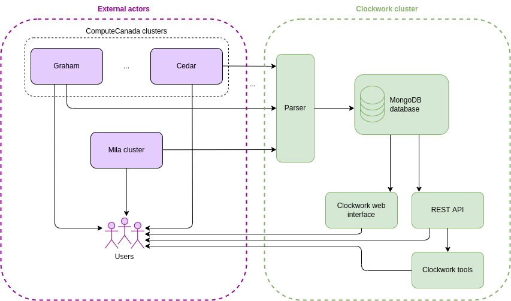

# Clockwork cluster

**Important:**
* Many of the "readme" files are outdated, but still contain useful pieces
* The final layout/functionality of this repo are not known yet, so that
makes it hard to document properly
* The most relevant Readme file is
[docker-compose.yml](https://https://github.com/mila-iqia/clockwork/blob/master/docker-compose.yml)
and we can see how to use it by looking at the various `.sh` files
in the top level of this repo.

## Overview

The Clockwork cluster is a set of tools, API endpoints and a web interface
destined to expose jobs and nodes information from [Mila](https://docs.mila.quebec/)
and [ComputeCanada](https://docs.computecanada.ca/) clusters.

The authentication to the Clockwork cluster requires a `@mila.quebec` mail account.

## Documentation

The documentation is generated with Sphinx.
In the "docs" directory, build the documentation with:
```
make rst; make html
```

The other Markdown files of this Git are the following:
* Clockwork tools
  * [Global information](clockwork_tools/README.md)
  * [Tests information](clockwork_tools_test/README.md)
* Clockwork web
  * [Global information](clockwork_web/README.md)
  * [Tasks to be discussed](clockwork_web/TODO.md)
  * [Notes about the interaction with MongoDB](clockwork_web/about_queries.md)
  * [Examples of REST calls](clockwork_web/REST_API.md)
  * [Tests information](clockwork_web_test/README.md)
* Slurm state
  * [Global information](slurm_state/README.md)
  * [CRON scripts information](slurm_state/cron_scripts/README.md)

## Global architecture

The Clockwork cluster interacts with the Mila and ComputeCanada clusters as
presented in the scheme below: the information provided by the clusters through
Slurm is parsed and stored to a MongoDB database.
The latter is then accessible to the users through a web interface, tools and a
REST API.



## Internal architecture

The Clockwork cluster can be divided into five main components:
* the MongoDB database
* the module to scrape Slurm information
* the REST API
* the python module
* the web interface.

Here is a quick description of these entities:

| Name | Description |
| -- | -- |
| MongoDB database | Stores the jobs and nodes information retrieved from the clusters through Slurm. More details about its populating in [`slurm_state`'s documentation](slurm_state/README.md), and about how it is requested in [`clockwork_web`'s documentation](clockwork_web/README.md). |
| Module scraping Slurm information | Retrieves the relevant information by parsing and anonymizing the result of `sinfo` Slurm commands periodically launched on the clusters. It is then used to fill the MongoDB database, which will be requested by the other modules. More details in [`slurm_state`'s documentation](slurm_state/README.md). |
| REST API | Provides jobs and nodes information through REST requests. It is used by the Clockwork tools, but can also be requested by the users. More details in [`clockwork_web`'s documentation](clockwork_web/README.md). |
| Python tools | Provides jobs and nodes information through a Python library, in order to ease the use of Clockwork in development. More details in [`clockwork_tools`'s documentation](clockwork_tools/README.md) |
| Web interface | Presents the jobs and nodes information in a graphical way. More details in [`clockwork_web`'s documentation](clockwork_web/README.md). |


## Github structure

**The main folders** of this repository are:

| Folder | Content |
| -- | -- |
| clockwork_web | The web server, to be deployed by IDT |
| clockwork_web_test | Unit tests for "clockwork_web" |
| clockwork_tools | Python module to be used by Mila members in conjuction with prod instance "clockwork_web" |
| clockwork_tools_test | Unit tests for "clockwork_tools" |
| slurm_state | Internal tools to parse the slurm reports from many clusters |
| slurm_state_test | Unit tests for "slurm_state" |
| test_common | Some functions used by two or more of the "_test" components |
| scripts | Useful scripts for occasional uses internally |
| docs | Documentation for this project, to be published externally |

**The scripts** located in the top level of this repository are the following:

| File    | Use |
| -- | -- |
| cov.sh  | Reports coverage statistics on the testing modules (`clockwork_web_test`, `clockwork_tools_test` and `slurm_state_test`) |
| dev.sh  | Builds the `clockwork_dev` image and launches it through the `docker_compose` |
| env.sh  | Used by `dev.sh` and `test.sh`, it exports all the useful environment variables (shared between the different containers of the docker-compose for instance) |
| test.sh | Launches all the unit tests |

Finally, **the `clockwork_dev.Dockerfile` and the `docker-compose.yml` files** are used by the script `dev.sh`
in order to launch all the containers to set up the Clockwork cluster locally.

### Summary of who runs what where

| component | launched by | target audience | runs against which clockwork_web |
|--|--|--|--|
| clockwork_web | IDT | everyone at Mila | N/A |
| clockwork_web_test | IDT | IDT | dev instance in docker container |
| clockwork_tools | N/A | everyone at Mila  | prod |
| clockwork_tools_test | IDT | IDT | dev instance in docker container |
| slurm_state | IDT | IDT | mongodb instance (dev or prod) |
| slurm_state_test | IDT | IDT | dev instance in docker container |


## Brief overview of the `docker-compose`

The `docker-compose` uses six images:
* the `clockwork_web` image
* the `clockwork_web_test` image
* the `clockwork_tools_test` image
* the `slurm_state_test` image
* the `clockwork_dev` image
* the `mongo` image

The four first images mentioned previously are created using Dockerfiles in
their related directories, which are listed in [Github structure](#github-structure).

The two remaining images are the following:
* **The `mongo` image** is the official MongoDB image, used in order to set up
the database.
* **The `clockwork_dev` image** gathers all the requirements listed in the
different folders. Its Dockerfile (`clockwork_dev.Dockerfile`) is located  in the top level of this repository.

## Installation - Development

### Modules needed

The modules necessary for the project are the following:

```bash
# for main project
python3 -m pip install flask flask-login numpy pymongo oauthlib coverage black
# for docs
python3 -m pip install sphinx myst_parser sphinx_rtd_theme sphinxcontrib.httpdomain
```

### Setting up

The dev environment can be set up thanks to the `dev.sh` script, located at the
top level of this repository.

```bash
bash dev.sh
```

### Testing

The tests can be launched through the `test.sh` script, located at the top level
of this repository.

```bash
bash test.sh
```
