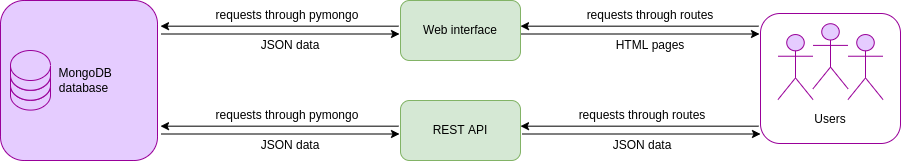

# Clockwork cluster web server

## Overview

The Clockwork web gathers the web services directly accessible for the user.
It can be split into two entities:
* the REST API
* the web interface.

Both of these entities will receive inputs from the user, and interact with
the MongoDB database in order to retrieve information about nodes and jobs.
As presented in the following image, the REST API returns JSON responses, while the web interface returns this
information in a graphical way.



Finally, for most of these requests, the user will need an authentication. This
is done by using Google's OAuth 2.0.

## Documentation

This folder contains several Markdown files, listed below:
* [List and ideas of tasks to be done](TODO.md)
* [Notes related to the MongoDB](about_queries.md)
* [REST API - Examples of calls](REST_API.md)

## Structure

The files can be either used in order to set up the REST API endpoints, to
display data in a visual way, or to deserve these two purposes. They are
respectively called here the "REST API files", the "Web interface files" and
the "Common files", regarding their purpose.

### Common files

The file either used by the REST API and the web interface are located in the
top level of the repository, and in the folder `core`.

Thus, **the folder** related to the common files is presented in this (short) array:

| Folder | Content |
| -- | -- |
| core | Common functions not related to authentication, used either by the `browser_routes` and the `rest_routes` in order to get information on jobs and nodes from the database |

The other **common files** are the following:

| File | Use |
| -- | -- |
| Dockerfile | Dockerfile used to create the image `clockwork_web` |
| db.py | Handles the connection to the MongoDB database |
| login_routes.py | Handles the OAuth part of the server |
| main.py | Creates the app and set the required environment variables |
| requirements.txt | The installation requirements to set up `clockwork_web`. It is namely used by the `Dockerfile` |
| server_app.py | Instantiates the Flask app and wires up all the routes in the right place |
| user.py | Defines a "user" properties, as well as an "anonymous user"'s ones |


### REST API files

The **folder** containing the REST API files is `rest_routes`.

| Folder | Content |
| -- | -- |
| rest_routes | Defines the REST API endpoints related to the authentication, the jobs requests and the nodes requests |

### Web interface files

The **folders** containing only web interface files are the following:

| Folder | Content |
| -- | -- |
| browser_routes | Handles the web interface's pages, related to the jobs and nodes' display, and the settings |
| static | Gathers the CSS, fonts and Javascript files, as well as the images, used to display the pages |
| templates | Gathers the HTML templates to be used by the `browser_routes` |

## Technologies

* Python
* Docker
* HTML, CSS, JS
* JSON
* See `requirements.txt`.

## How to run locally (no authentication)

[THIS IS OBSOLETE.]

You can run this with your own python environment, either with
your own instance of a mongodb server, or with the same one
on Atlas that the Google Cloud deployment uses.

It exposes a special route `/login/fake_user` that sets the current_user
to something that allows for easier development of the routes
that require some kind of user in order to matter (e.g. user settings).

```bash
export FLASK_RUN_PORT=5550
export FLASK_DEBUG=1
export FLASK_APP=main.py

## the Atlas mongodb
# export MONGODB_CONNECTION_STRING="don't commit this to github"
# export MONGODB_DATABASE_NAME="clockwork"

## your local mongodb instance
export MONGODB_CONNECTION_STRING="don't commit this to github"
export MONGODB_DATABASE_NAME="clockwork"

# This is sufficient to disable the @login_required,
# but also to enable the /login/fake_user route.
export LOGIN_DISABLED=True

# local connections only
#    python3 -m flask run
# outside
python3 -m flask run --host=0.0.0.0
```
