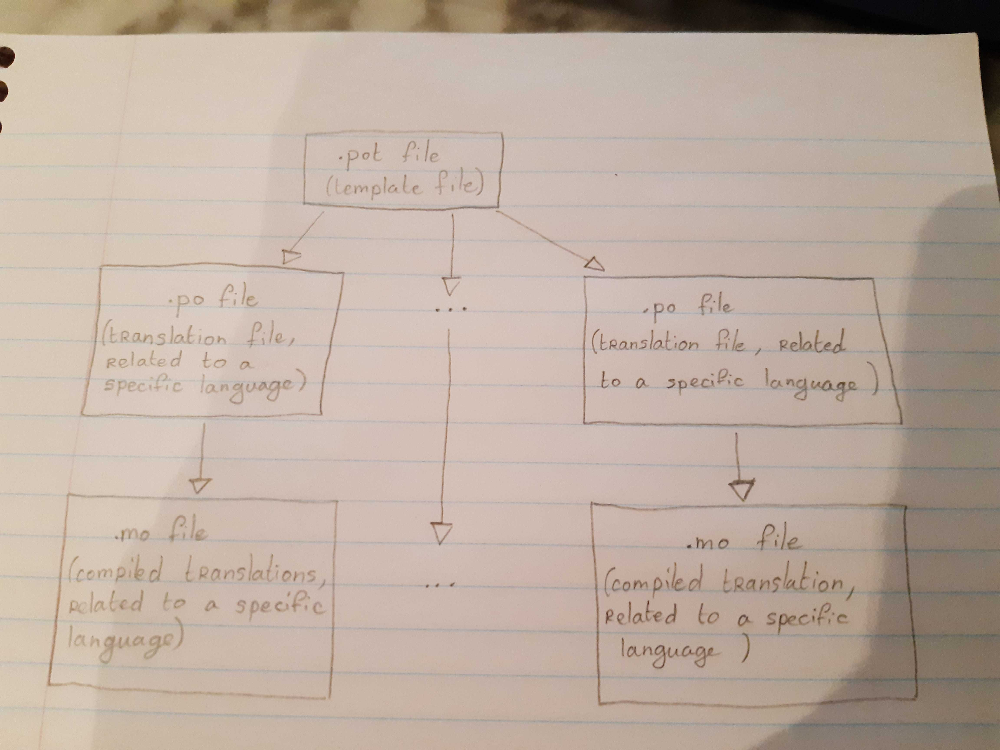

# Internationalization

Clockwork uses [Flask-Babel](https://pypi.org/project/Flask-Babel/) to handle the different languages of the web interface. This document contains an overview of its main concepts through three sections: "Global process", "Files summary" and "Summarized processes".

## Global process
### 1. Translate a string in the code
In order for a string to be translated, it has to be wrapped in the function `gettext`, imported as follows:
```
from flask_babel import gettext
```

The sentences wrapped in `gettext` can be then gathered in translations files, described in the [following section](#generate-translation-files).

In the Clockwork web interface, the original sentences are in English.

### 2. Generate the associated translation files
#### Overview
To handle the translations, Flask-Babel is based on three types of files, presenting the extensions `pot`, `po` and `mo`.

1. First of all, a `.pot` file is generated. It is a template gathering all the translations.
2. Then, `.po` files based on this `.pot` files are generated: one for each language (except for English, as the base sentences can be used). They contain the translations related to their languages.
3. Finally, `.mo` files are generated from the `.po` files. Thus, each language presents one `.mo` file too. The `.mo` file is a compiled `.po` file, and is used by the app.

The following scheme presents an overview of these files generation.



Thus, the translations specific to each language are contained in the `.po` files. They are the ones which will be pushed on the Github repository. This section presents more details about each one of these files.

#### The template file (`.pot` file)
##### Description
The template file (presenting the `.pot` extension) is the template on which the translation files (`.po`) are based. It is generated from the code and gathers all the sentences to be translated.
##### Generation
The `.pot` file can be generated by the following command line:
```
pybabel extract -F clockwork_web/babel.cfg -o clockwork_web/static/locales/messages.pot clockwork_web/
```

with:
* `clockwork_web.babel.cfg` the Flask-Babel configuration file. It indicates where to search for sentences to translate. It contains the following lines:
  ```
  [python: **.py]
  [jinja2: **/templates/**.html]
  ```
* `clockwork_web/static/locales/messages.pot` the output file. It is the path of the generated `.pot` file
* `clockwork_web/` the folder in which the sentences to translate (the ones wrapped in `gettext`) are searched, using the configuration file.

##### Format
In the `.pot` file, the sentences to translate are presented as follow:
```
#: clockwork_web/browser_routes/clusters.py:56
msgid "This cluster is not known."
msgstr ""

#: clockwork_web/browser_routes/clusters.py:64
msgid "The argument cluster_name is missing."
msgstr ""

#: clockwork_web/templates/settings.html:44
msgid "user settings %(mila_email_username)"
msgstr ""

#: clockwork_web/templates/cluster.html:78
#: clockwork_web/templates/cluster.html:83
msgid "Display all the jobs running on this cluster"
msgstr ""
```

Thus, for each sentence to translate, the path(s) of the file(s) where it is contained is(/are) presented, followed by the English sentence to translate, playing the role of id. Finally, a `msgstr` followed by an empty string is presented. **The `.pot` file is used to generate the `.po` files. It is a template. Thus, the empty string do not have to be filled.**

#### The translation files (`.po` files)
##### Description
Each translation files (presenting the `.po` extension) is related to one specific language. As Clockwork uses only two languages (French and English), only one translation file is handled (the French one, as English is the default language, so that each English sentences serve as keys to identify a string to be translated).

A translation file (`.po`) is generated from a template file (`.pot`). It associates each sentence to be translated to the translated sentence in the related language. These translated sentences have to be added manually.

##### Generation
The `.po` files can be generated from the `.pot` file by the command line:
```
pybabel init -i clockwork_web/static/locales/messages.pot -d clockwork_web/static/locales/ -l fr
```

with:
* `clockwork_web/static/locales/messages.pot` the template translation file as input
* `clockwork_web/static/locales/` the folder where the `.po` files will be create
* `fr` the name of the translation language (French in our case)

This command line creates the file `/locales/fr/LC_MESSAGES/messages.po`

##### Update
If the `.pot` file has been changed (because some sentences have been added for instance), the `.po` files can be updated by the following command:
```
pybabel update -i clockwork_web/static/locales/messages.pot -d clockwork_web/static/locales/
```

with:
* `clockwork_web/static/locales/messages.pot` the template translation file as input
* `clockwork_web/static/locales/` the folder where the `.po` files will be create

##### Format
In the `.po` file, the sentences to translate and their associated translations are presented as follows:
```
#: clockwork_web/browser_routes/clusters.py:56
msgid "This cluster is not known."
msgstr "Le cluster n'a pas été trouvé."

#: clockwork_web/browser_routes/clusters.py:64
msgid "The argument cluster_name is missing."
msgstr "L'argument cluster_name n'a pas été renseigné."

#: clockwork_web/templates/settings.html:44
msgid "user settings %(mila_email_username)"
msgstr "Paramètres de l'utilisateur %(mila_email_username)"

#: clockwork_web/templates/cluster.html:78
#: clockwork_web/templates/cluster.html:83
msgid "Display all the jobs running on this cluster"
msgstr "Afficher tous les jobs roulant sur ce cluster"
```

The format is very similar to the `.pot` file, but the translations are provided.

#### The compiled translation files (`.mo` files)
##### Description
Each compiled translation file (`.mo` file) is related to one specific language, such as the translation file (`.po` file) on which it is based. This file is generated from the translation file (`.po`) and does not require further modification after that. Flask directly uses the `.mo` files to handle the translation.

##### Generation
The `.mo` files can be generated from the `.po` files by the following command line:
```
pybabel compile -d clockwork_web/static/locales
```
with:
* `clockwork_web/static/locales` the folder where the subfolders corresponding to the different languages are.

## Files summary
The following table sums up what files are handled and what information they contain.

| Entity | Information |
| -- | -- |
| Code containing `gettext` calls (`.py` or `.html` for instance) | **English sentences** (from error messages, or stored in the HTML templates) |
| Template file (`.pot`) | Extracted and gathered **English sentences** from the code |
| Translation file associated to a specific language (`.po` files) | **Translations** for the current language |
| Compiled translation file associated to a specific language (`.mo` files) | **Translations** for the current language, but compiled |

## Summarized processes
This section contains a quick overview of the commands to run in order to set up and update the translation. Further details on the files and their respective roles can be found in the [Previous section](#global-process).

### Set up translation for the first time
1. [In the code] Wrap the sentence to be translated in `gettext`.

```
from flask_babel import gettext

[...]

gettext("String to translate")
```
2. [Through command line] Generate the template file (`.pot`)

```
pybabel extract -F clockwork_web/babel.cfg -o clockwork_web/static/locales/messages.pot clockwork_web/
```

3. [Through the command line] Generate the French translation file (`.po`).

```
pybabel init -i clockwork_web/static/locales/messages.pot -d clockwork_web/static/locales/ -l fr
```

4. [Manually] Fill the missing translations in the `.po` file.

5. ([Command line (but this is done by the clockwork_web and clockwork_dev Dockers)] Compile the translation files (to create `.mo` files).)

```
pybabel compile -d clockwork_web/static/locales
```

### Update pre-existing translation files
1. [In the code] Wrap the sentence to be translated in `gettext`.

```
from flask_babel import gettext

[...]

gettext("String to translate")
```
2. [Through command line] Generate the template file (`.pot`)

```
pybabel extract -F clockwork_web/babel.cfg -o clockwork_web/static/locales/messages.pot clockwork_web/
```

3. [Through the command line] Update the pre-existing translation file(s) (`.po`).

```
pybabel update -i clockwork_web/static/locales/messages.pot -d clockwork_web/static/locales/
```

4. [Manually] Fill the missing translations in the `.po` file.

5. ([Command line (but this is done by the clockwork_web and clockwork_dev Dockers)] Compile the translation files (to create `.mo` files)).

```
pybabel compile -d clockwork_web/static/locales
```
